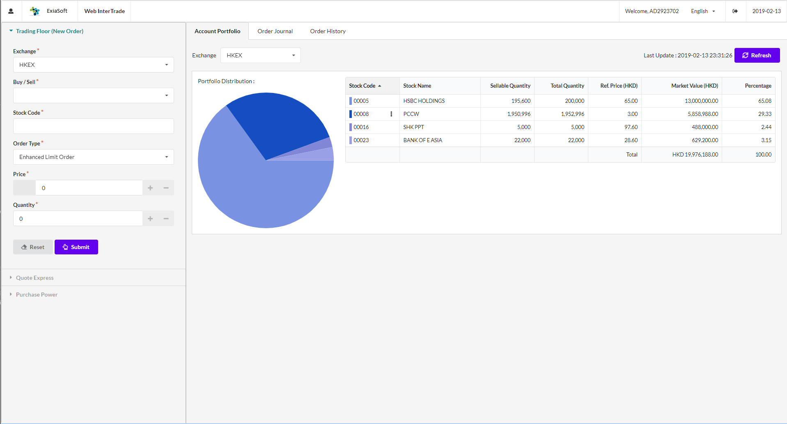
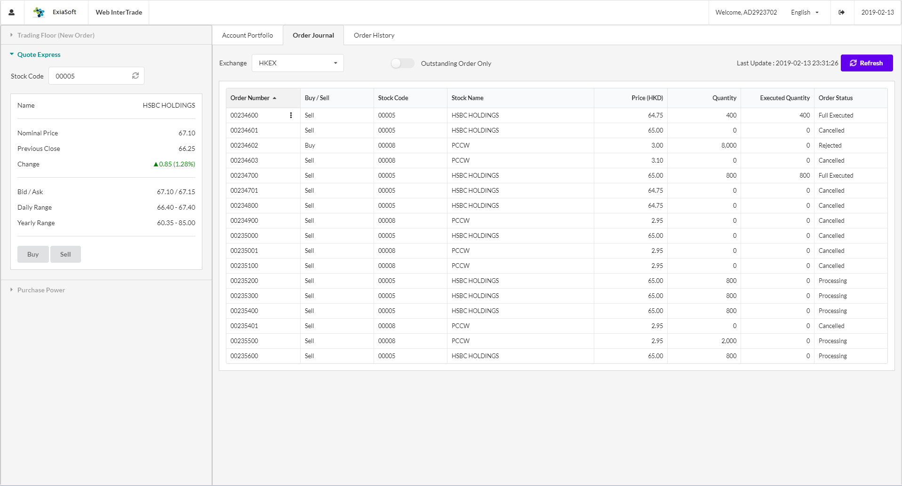

# itswebui

This is a sample (and simple) securities trading web application to demonstrate consumption of micro-services provided in project [itsmicrosrv](https://github.com/kc2wong/itsmicrosrv).

The initiative of this project is to build a library which helps to simplify web application developement in following areas
* Orchestration and consolidation of ui widgets and various useful libraries
* Form validation
* Restful service invocation and result handling
* Multilingual
* Theming

The level of completion is relatively low due to I shift my interest to reactive spring and flutter.  I will come back to this project some times later

## Table of Contents

- [Folder Structure](#folder-structure)
- [Prerequisites](#prerequisites)
- [Available Scripts](#available-scripts)
- [Libraries used](#libraries-used)
- [Supported Browsers](#supported-browsers)
- [Screen Shot](#screen-shot)


## Folder Structure

After creation, your project should look like this:

```
itswebui/
  README.md
  node_modules/
  package.json
  assets/
    i18n/
    images/
    styles/
  public/
    index.html
    favicon.ico
  src/
    app/
    shared/
    App.css
    App.js
    App.test.js
    index.css
    index.js
    logo.svg
```

For the project to build, **these files must exist with exact filenames**:

* `public/index.html` is the page template;
* `src/index.js` is the JavaScript entry point.
* `webpack.dev.config.js` is the configuration file.  Change the value of **@SERVER_API_URL** if the services of [itsmicrosrv](https://github.com/kc2wong/itsmicrosrv) is not running in the same host

Main directories
* `assets/i18n` contains language files for UI labels and messages.
* `assets/images` contains images files.
* `source/shared` contains common components and utilities.
* `source/app` contains application specific form and services.


## Prerequisites

* Node.js v8.11.2
* yarn 1.3.2


## Available Scripts

In the project directory, you can run:


### `npm install`

Install dependent librarires.  This script must be invoked before running the application

### `yarn start`

Runs the app in the development mode.<br>
Open [http://localhost:3000](http://localhost:3000) to view it in the browser.

A login dialog will be displayed.  Enter **AD2923702** as username and **111111** as password


## Libraries used

Some of the libraries used in this project: 
* [React](https://github.com/facebook/react)
* [Semantic UI React](https://react.semantic-ui.com/)
* [Lodash](https://lodash.com/)
* [react-day-picker](https://react-day-picker.js.org/)
* [react-minimal-pie-chart](https://github.com/toomuchdesign/react-minimal-pie-chart)
* [i18n-react](https://github.com/i18next/react-i18next)
* [immutability-helper](https://github.com/kolodny/immutability-helper)


## Supported Browsers

By default, the generated project uses the latest version of React.

You can refer [to the React documentation](https://reactjs.org/docs/react-dom.html#browser-support) for more information about supported browsers.

Testing is conducted mainly in Chrome with 2K resolution screen


## Screen Shot






